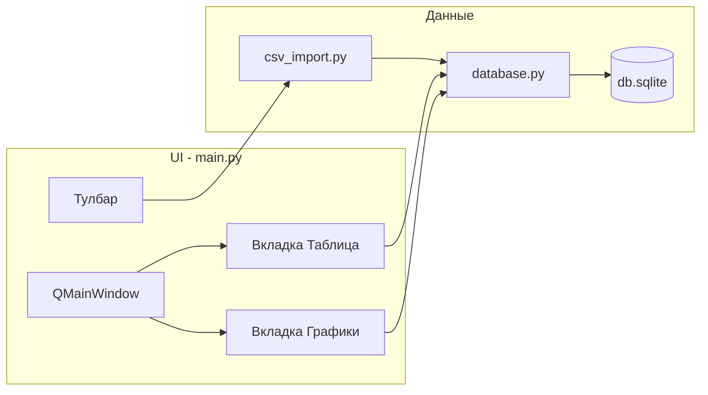

# План: Bank Statement Analyzer MVP

## Архитектура




## Структура проекта (4 файла)


| Файл               | Назначение                                                                                                              |
| ------------------ | ----------------------------------------------------------------------------------------------------------------------- |
| `main.py`          | QApplication, QMainWindow, вкладки (таблица + графики), тулбар, модель таблицы, делегат для категорий                   |
| `database.py`      | Подключение к SQLite, создание таблицы, CRUD (вставка транзакций, обновление категории, выборки для таблицы и графиков) |
| `csv_import.py`    | Парсинг CSV Тинькофф → DataFrame → вызов database для вставки                                                           |
| `requirements.txt` | PyQt6>=6.4.0, pandas>=2.0.0, matplotlib>=3.7.0                                                                          |


База данных: `%USERPROFILE%\.bank_analyzer\db.sqlite` (на Windows через `pathlib.Path.home() / ".bank_analyzer" / "db.sqlite"` — кросс-платформенно).

---

## 1. database.py

- **Путь к БД:** `Path.home() / ".bank_analyzer" / "db.sqlite"`. Создавать каталог `.bank_analyzer` при первом запуске, если его нет.
- **Таблица:** `CREATE TABLE IF NOT EXISTS transactions (id INTEGER PRIMARY KEY AUTOINCREMENT, date TEXT, description TEXT, amount REAL, category TEXT DEFAULT 'Без категории')`. Дата в формате ISO (YYYY-MM-DD или YYYY-MM-DD HH:MM:SS).
- **Функции:**
  - `get_connection()` — открытие соединения (при необходимости создание файла и директории).
  - `init_db(conn)` — создание таблицы.
  - `insert_transactions(conn, rows)` — вставка списка кортежей `(date, description, amount, category)`; возвращать можно не обязательно.
  - `update_category(conn, id, category)` — обновление категории по `id`.
  - `get_all_transactions(conn)` — выборка для таблицы: `id, date, description, amount, category` (например, список кортежей или список словарей).
  - `get_expenses_by_category_last_month(conn)` — агрегат по категориям за последние 30 дней, только `amount < 0` (сумма по модулю для отображения).
  - `get_expenses_by_day_last_week(conn)` — агрегат по дням за последние 7 дней, только расходы.

После каждой вставки/обновления вызывать `conn.commit()`.

---

## 2. csv_import.py

- **Чтение CSV:** `pandas.read_csv(path, sep=';', encoding='utf-8-sig')`.
- **Ожидаемые столбцы:** `Дата операции`, `Описание операции`, `Сумма операции`. Если заголовки отличаются (пробелы/регистр), привести к одному виду или переименовать.
- **Дата:** колонку «Дата операции» привести к формату ISO (например, `pd.to_datetime(..., format='...')` в зависимости от формата Тинькофф — часто `dd.MM.yyyy` или с временем). Результат в строку ISO для SQLite.
- **Сумма:** преобразовать в float. Тинькофф может использовать запятую как десятичный разделитель — заменить на точку или использовать `decimal=','` в `read_csv`.
- **Категория:** по умолчанию `'Без категории'` для всех строк.
- **Функция:** например `import_from_csv(path) -> int` — парсит файл, вызывает `database.insert_transactions` и возвращает количество загруженных строк. Использовать общее подключение к БД (передавать `conn` в функцию или получать внутри модуля — по согласованию с main).

---

## 3. main.py

- **Точка входа:** `if __name__ == "__main__":` — создание `QApplication`, инициализация БД, создание и отображение главного окна, `app.exec()`.

**Главное окно (QMainWindow):**

- **Тулбар:** кнопка «Загрузить CSV» — открыть `QFileDialog.getOpenFileName` (фильтр `*.csv`), вызвать `csv_import.import_from_csv(path)`, обновить модель таблицы и статус-бар (например, «Загружено N записей»). Кнопка «Графики» — переключить `QTabWidget` на вкладку с графиками (и при переключении обновить диаграммы).
- **QTabWidget:** две вкладки — «Транзакции», «Графики».

**Вкладка «Транзакции»:**

- **Модель:** `QStandardItemModel`. Столбцы: Дата, Описание, Сумма, Категория. Хранить `id` транзакции в `Qt.UserRole` в первой колонке (или в скрытой колонке), чтобы при сохранении категории вызывать `update_category(conn, id, category)`.
- **Таблица:** `QTableView`, модель выше. Редактирование только для колонки «Категория» через делегат.
- **Делегат для категории:** при двойном клике по ячейке категории показывать `QComboBox` со списком: `Продукты`, `Транспорт`, `Развлечения`, `Кафе`, `Без категории`. После выбора — обновить модель, вызвать `database.update_category(conn, row_id, category)` и `commit`.

**Вкладка «Графики»:**

- **Виджет:** вертикальный layout с двумя виджетами matplotlib: `FigureCanvasQTAgg` (из `matplotlib.backends.backend_qtagg`).
- **График 1 — круговая диаграмма:** данные из `get_expenses_by_category_last_month`; только расходы (уже отфильтровано в БД). `ax.pie(sizes, labels=categories, autopct='%1.1f%%')`.
- **График 2 — столбчатая:** данные из `get_expenses_by_day_last_week`; по оси X — дни, по Y — сумма расходов (по модулю). `ax.bar(dates, amounts)`.
- При переключении на вкладку «Графики» перезапрашивать данные из БД и вызывать `canvas.draw()`.

**Инициализация при запуске:** создать/открыть БД, вызвать `init_db`, загрузить данные в таблицу через `get_all_transactions` и заполнить модель.

---

## 4. requirements.txt

```
PyQt6>=6.4.0
pandas>=2.0.0
matplotlib>=3.7.0
```

Запуск: `python main.py` (после `pip install -r requirements.txt`).

---

## Важные детали реализации

- **Формат даты Тинькофф:** в выписках часто `ДД.ММ.ГГГГ ЧЧ:ММ` или `ДД.ММ.ГГГГ`. В csv_import при парсинге указать подходящий `format` в `pd.to_datetime` и сохранять в БД как строку ISO.
- **Сумма:** в CSV может быть строка вида `-100,50` или `-100.50`. Обработка через `replace(',', '.')` или `read_csv(..., decimal=',')` и приведение к float.
- **Сохранение id в таблице:** при заполнении `QStandardItemModel` положить `id` в `item.setData(id, Qt.ItemDataRole.UserRole)` для ячейки в колонке 0 (или для каждой строки в одном и том же месте), чтобы делегат при сохранении категории мог получить `id` строки.
- **Один conn или пул:** для MVP достаточно открывать соединение при старте и передавать его в database/csv_import или хранить в модуле database и получать через `get_connection()`. Важно не забывать коммитить после вставки и обновления.

---

## Критерий готовности MVP

- Запуск `python main.py` без ошибок.
- Кнопка «Загрузить CSV» открывает диалог, после выбора файла Тинькофф транзакции появляются в таблице.
- Двойной клик по ячейке «Категория» открывает список категорий, после выбора значение сохраняется в БД и отображается в таблице.
- Вкладка «Графики» показывает круговую диаграмму расходов по категориям за последний месяц и столбчатую — по дням за последнюю неделю; только расходы (amount < 0).

После выполнения плана приложение будет соответствовать описанному MVP и запускаться «из коробки» после установки зависимостей.